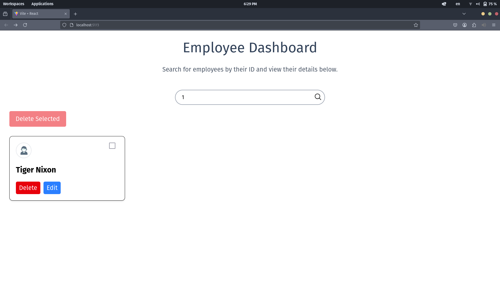

(Due to technical issues, the search service is temporarily unavailable.)

Certainly! Below is a well-structured and helpful `README.md` for your project. It provides an overview of the project, instructions for setup, and details about its features.

---

# Employee Dashboard

 <!-- Add a screenshot if available -->

The **Employee Dashboard** is a React-based web application that allows users to view, search, and manage employee data. It fetches employee information from an API, displays it in a user-friendly interface, and provides features like searching, deleting, and viewing employee details.

---

## Features

- **View Employee Data**: Display a list of employees with their details (name, age, salary).
- **Search Employees**: Search for employees by their exact ID.
- **Clickable Cards**: Click on an employee card to view detailed information on a separate page.
- **Delete Employees**: Delete an employee from the list (frontend-only, no database changes).
- **Edit Button**: Placeholder button for future edit functionality.
- **Multi-Select and Delete**: Select multiple employees and delete them in one go.
- **Responsive Design**: Works seamlessly on desktop and mobile devices.

---

## Technologies Used

- **Frontend**:
  - React
  - React Router (for navigation)
  - Tailwind CSS (for styling)
- **API**:
  - [Dummy REST API](https://dummy.restapiexample.com/) (for employee data)

---

## Getting Started

Follow these steps to set up and run the project locally.

### Prerequisites

- Node.js (v16 or higher)
- npm (v8 or higher)

### Installation

1. **Clone the repository**:
   ```bash
   git clone https://github.com/your-username/employee-dashboard.git
   cd employee-dashboard
   ```

2. **Install dependencies**:
   ```bash
   npm install
   ```

3. **Start the development server**:
   ```bash
   npm run dev
   ```

4. **Open the app**:
   Visit `http://localhost:5173` in your browser.

---

## Usage

### Viewing Employees
- The homepage displays a list of employees fetched from the API.
- Each employee card shows their name, age, and salary.

### Searching Employees
- Use the search bar to find an employee by their exact ID.
- If no match is found, a "No employees found" message is displayed.

### Deleting Employees
- Click the **Delete** button on an employee card to remove them from the list.
- To delete multiple employees:
  1. Select employees by checking the checkboxes on their cards.
  2. Click the **Delete Selected** button at the top of the page.

### Viewing Employee Details
- Click on an employee card to navigate to their details page.
- The details page shows the employee's ID, name, age, and salary.

### Edit Button
- The **Edit** button is a placeholder for future functionality. It does not perform any action yet.

---

## API Integration

The app fetches employee data from the [Dummy REST API](https://dummy.restapiexample.com/). The following endpoint is used:

- **Get All Employees**: `GET /api/v1/employees`

---

## Customization

### Styling
The app uses **Tailwind CSS** for styling. You can customize the styles by editing the Tailwind configuration in `tailwind.config.js` or by adding custom CSS.

### Environment Variables
If you want to use a different API endpoint, you can add it to a `.env` file:

```env
VITE_API_URL=https://dummy.restapiexample.com/api/v1
```

Then, update the fetch calls in `App.jsx` to use `import.meta.env.VITE_API_URL`.

---

## Acknowledgments

- [Dummy REST API](https://dummy.restapiexample.com/) for providing the employee data.
- [React](https://reactjs.org/) and [Vite](https://vitejs.dev/) for the development framework.
- [Tailwind CSS](https://tailwindcss.com/) for the styling framework.

---

## Screenshots

### Homepage
 <!-- Add a screenshot of the homepage -->

### Employee Details Page
 <!-- Add a screenshot of the details page -->

### Search Functionality
 <!-- Add a screenshot of the search functionality -->

---

## Contact

If you have any questions or feedback, feel free to reach out:

- **Abhishek Saikia**: [Email](mailto:abhisheksaikia766@gmail.com)
- **GitHub**: [KingrogKDR](https://github.com/KingrogKDR

---

This `README.md` provides a comprehensive overview of your project, making it easy for users and contributors to understand and use. Let me know if you'd like to add or modify anything!
